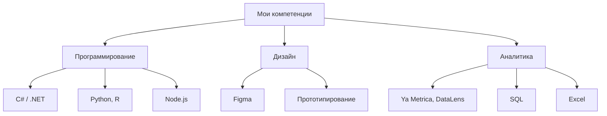

  

[//]: # "Приветствую тебя, любитель заглянуть в чужой код!"
<h1 align="center">Привет👋 Меня зовут Влад!</h1>

<h3 align="left">👀 (Не)много обо мне:</h3>

Я студент Высшей Школы Экономики 🤓 по программе <strong>"Бизнес-информатика"</strong> с 2023 года. 
На базовом уровне владею языками программирования <strong>C#</strong>, <strong>Python</strong>, <strong>R</strong> и <strong>Node.js</strong>. 
Знаком с фреймворками:
  
* <strong>ASP.NET (WPF)</strong>
* <strong>React</strong>
* <strong>Windows Presentation Foundation (WPF)</strong>
* <strong>Flet</strong>

Библиотеками

* <strong>Ant-design, PrimeReact, Tabulator</strong> для таблиц React
* <strong>AntV G6</strong> для графов React
* <strong>NumPy, SciPy, Matplotlib, Pandas, Manim</strong> для вычислений и визуализации математики
* <strong>NAudio.midi</strong> для звука музыкальных инструментов

Уверенно владею стандартными программами Windows (<strong>Word, Excel и PowerPoint</strong>), а также: <strong>Яндекс.Метрика, BPMN.io, Xmind, Miro, DataLens Yandex</strong>. 
Умею работать в системе контроля версий <strong>GitHub</strong>. 
Также активно учусь работать со звуком в <strong>Cakewalk</strong>. 

В свободное время занимаюсь творчеством: пишу собственные песни на гитаре 🎸 (а иногда других инструментах) и стихи 📜✍. Также увлекаюсь танцами, в основном историческими 🕺. Касаемо спорта, занимался скалолазанием 🧗‍♂️ и настольным теннисом 🏓, тренирую элементы на турниках 💪.

[//]: # "и рисованием 🎨"

<h3 align="left">💻 Технологии:</h3>

  
- **C# / .NET** (Entity Framework Core, LINQ, ASP.NET Core)
- **Node.js** (React)
- **Python** (Colab, Flet)
- **R** (RStudio)
- **Базы данных** (PostgreSQL, EF Core)

  
  
  
  
  
  
  
  
  
  
  
  
  
  
  
  

<h3 align="left">🛠️ Инструменты программирования:</h3>

  
- **Github**
- **Visual Studio / VS Code / PyCharm**
- **Colab, Kaggle**
- **Matplotlib, NumPy, Manim**
- **Figma**

  
   
  
  
  
  
  
  
  
  
  
  
  
  
  

  
  
  
  
  
  

<h3 align="left">🛠️ Инструменты аналитики:</h3>

  
- **Yandex.Metrika / Wordstat / Datalens / keys.so**
- **bpmn.io / Dbdiagram / Miro / plantuml**

  
  
  
  
  
  
  
   
  
   

[//]: # "https://github.com/devicons/devicon/blob/v2.16.0/icons/xamarin/xamarin-original.svg"
[//]: # "https://www.ph4.org/_RU/DL/LOGO_ICON/y/ya_metrika.gif"
[//]: # "https://github.com/devicons/devicon/blob/v2.16.0/icons/"

<h4 align="left">График компетенций:</h3>

  

<h3 align="left">📚 Пройденные курсы:</h3>

| Курс | Платформа / ВУЗ | Год | Статус |
|------|-----------------|-----|--------|
| [Веб-аналитика для цифрового маркетинга](https://disk.yandex.ru/i/21QA12cN4ATjMA) | СИТУ | 2025 | ✅ Завершен |
| ["Поколение Python": курс для начинающих](https://stepik.org/course/58852/info) | Stepik | 2021 | ✅ [Завершен](https://stepik.org/cert/1308369)|
| ["Поколение Python": курс для продвинутых](https://stepik.org/course/68343/info) | Stepik | 2022 | 📚 В процессе |

<h3 align="left">🔥 Моя статистика :</h3>

  

  

  

<h3 align="left">🌐 Социальные сети:</h3>

  
  
  
  
  
  
  
  

<h3 align="left">📬 Контактные данные:</h3>
Рабочая почта: vobannikov@edu.hse.ru

<h2 align="center">До скорых встреч!</h2>

  

<!--
Заходите как-нибудь ещё!
Приятного кодинга ;)
-->
